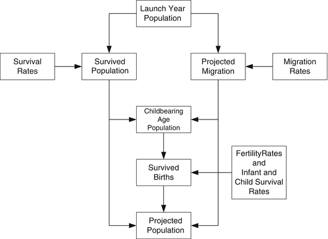
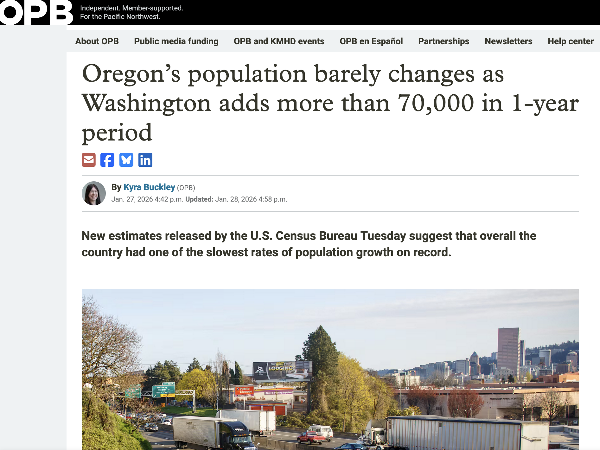
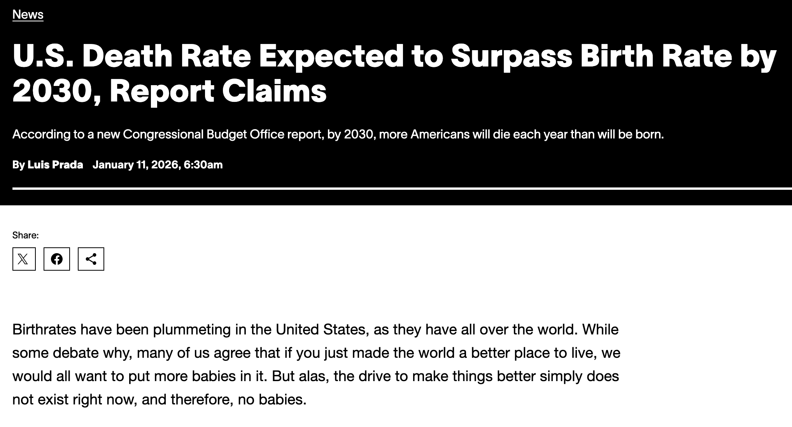
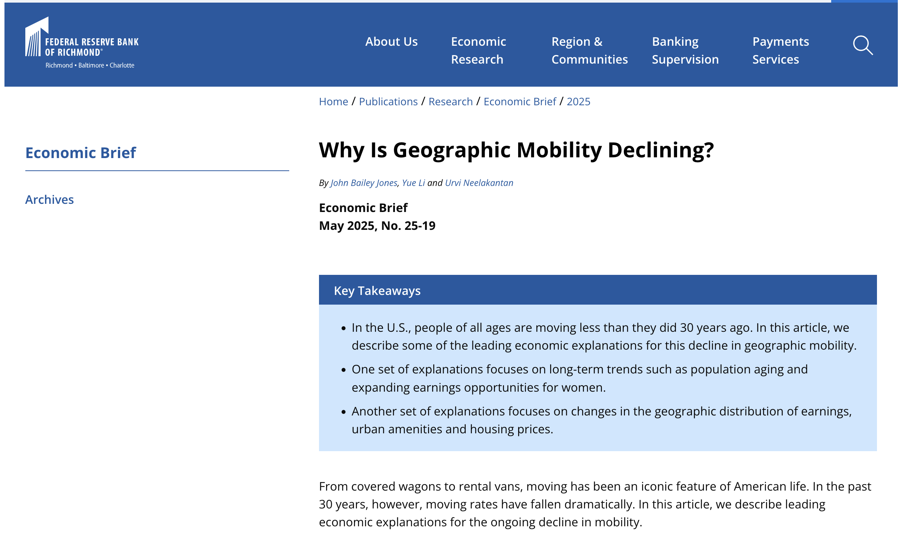

class: center

# Comments or Questions?

## Contact PSUPRC
Email: [askprc@pdx.edu](mailto:askprc@pdx.edu)  
Telephone: 503-725-3922


## Proposal Population Projections
https://www.pdx.edu/population-research/population-forecasts

---

class: center

# PSUPRC Project Team

.pull-left[

**Huda Alkitkat, PhD.**  
*Population Estimates Manager*

**Seth Dowden**  
*Research Assistant*

**Neal Marquez, PhD.**  
*Population Forecast Manager*

**Gilbert Montcho, PhD.**  
*Demographic & Labor Econ Analyst*

**Scott Nordstrom, PhD.**  
*Post-Doctoral Researcher*
]

.pull-right[
**Ethan Sharygin, PhD.**  
*Director*

**Aja Sutton, PhD.**  
*Post-Doctoral Researcher*

**David Swanson, PhD.**  
*Research Associate*

**Suniva Thangaraj**  
*Program Manager*

**Joshua Wilde, PhD.**  
*Research Scientist*
]

---

# Coos County Outline

- Introduction
- Updates
- County Overview
- UGB Forecasts

``` {css, echo =F} 
    .pulll-left {
      float: left;
      width: 20%;
    }

    .pulll-right {
      float: right;
     width: 68%;
   }
```

``` {css, echo =F} 
    .pux-left {
      float: left;
      width: 38%;
    }

    .pux-right {
      float: right;
     width: 58%;
   }
```

``` {css, echo =F} 
    .puz-left {
      float: left;
      width: 58%;
    }

    .puz-right {
      float: right;
     width: 38%;
   }
```

```{css, echo = F}
.city table {
  font-size: 14px;     
}
```

---

# PSUPRC OPFP Population Forecasts

.puz-left[
- For the purposes of land use planning PSUPRC generates population forecasts
- For counties, urban growth boundaries (UGBs), and areas outside UGBs
- These forecasts must
    - Be updated at least every four years
    - Cover a 50 year forecast horizon
    - Include most up to date data
    - Allow for public input/objections
    - Methods & results publicly available

]

.puz-right[

]

---
# Oregon Population Forecast Program Cycle


---
# Methods Review: Cohort Component Method

.pux-left[
- For Counties
- Births = Females 15-50 * Birth Rate
  - Both number of and rate of births in OR decreasing
- Deaths = All Population * Death Rate
  - While number of deaths are increasing rate of deaths decreasing
- Migration = Past migration events
  - Average of past migration is most likely scenario moving forward

]

.pux-right[

]

---
# Methods Review: Housing Unit Method

.pull-left[
- For UGBs
- $P_t = P_{t-1} + \Delta HU*PPH*OCC$
- $PPH$: Persons per household
  - Estimated from most recent census data
- $OCC$: Occupancy Rate
  - Estimated from most recent census data
- $\Delta HU$: annual change in housing units
  - Modeled based on past housing unit growth trends

]

.pull-right[

]

---
# After this meeting

- Email for further follow up  
- March 30, 2026 forecast discussion period ends
- Chance to formally appeal until May 15, 2026
  - Will review appeals in the following week
- No further changes will be made after May 22, 2026
- Reports and data tables will be available June 15, 2026


---
class: center, middle, inverse

# Updates

---
# Survey and Preliminary Meeting Feedback

- Received housing and general survey responses from over 20 organizations
- Updated GIS UGB boundary lines 
- Account for large public works alter housing development trajectories
- Incorporate group quarter expansions
- Adjusted housing unit productions
- Housing build moratoriums
- General concerns
  - Restrictions on development  
  - Access to others responses
  
---
# Incoporation of 2025 Certified Estimates  


---
# Slowing Growth Across the State



---

# Changes in Vital Trends



---

# International Migration


---

# Domestic Mobility



---
class: center, middle, inverse

# Coos County

---

# Summary of Considerations

- Coos County's population has been stable but aging
- Population neither expected to increase nor decline
- Aging will continue
- Changes made to population growth in Bandon to reflect recent devlopment

---

# Coos at a Glance

```{r echo = FALSE, message = FALSE, warning = FALSE}
library(tidyverse)
library(plotly)
focus_county <- "Coos"
model <- "model_41"
model_ugb <- "model_41a_constrained"

county_plots <- "../../../../model_plots/plots_" %>%
    str_c(model, ".rds") %>%
    read_rds()
ugb_plots <- "../../../../model_plots/ugb_plots_" %>%
    str_c(model_ugb, ".rds") %>%
    read_rds()
map_list <- "../../../../maps/ugb_city_compare_html/" %>% 
    str_c(focus_county, ".rds") %>%
    read_rds()
sector_plots <-  "../../../../processing_plots/sector_trends/sector_plots.rds" %>% 
    read_rds()
mig_plots <- "../../../../processing_plots/county_migration/" %>%
    str_c("county_migration.rds") %>%
    read_rds()

source("../../../../../Utilities/00_common_functions.R")

null0 <- capture.output(place_stat_df <- read_hist_data(
    county = FALSE, adjust_for_inflation = FALSE) %>%
    left_join(
        distinct(read_csv(ugb_cw_file), COUNTYID, CITYID, COUNTY, UGB),
        by = "CITYID", relationship = "many-to-many") %>% 
    filter(COUNTY == focus_county & UGB != "Metro") %>%
    filter(YEAR %in% c(1980, 2000, 2020)) %>%
    select(CITY, POP = POPULATION, HU, OVER65, OCC, EMPRATE, PPH, MHI, YEAR) %>%
    mutate(OVER65 = OVER65/POP*100, OCC = OCC/HU*100, EMPRATE = EMPRATE*100) %>%
    mutate(across(OVER65:PPH, function(x)sprintf("%.2f", x))) %>%
    mutate(across(POP:HU, function(x)prettyNum(x, ","))) %>%
    mutate(OVER65 = str_c(OVER65, "%")) %>%
    mutate(OCC = str_c(OCC, "%")) %>%
    mutate(EMPRATE = str_c(EMPRATE, "%")) %>%
    mutate(MHI = str_c("$", prettyNum(MHI, ","))) %>%
    select(
        CITY, YEAR, `Pop 65+` = OVER65, `Housing Units` = HU,
        `Housing Occupancy` = OCC, `Persons Per Household` = PPH,
        `Household Income` = MHI, `Employment Rate` = EMPRATE) %>%
    pivot_longer(-(CITY:YEAR)) %>%
    pivot_wider(names_from = YEAR) %>%
    rename(Metric = name))

cen_demog_df <- read_hist_data(OR_only = TRUE, adjust_for_inflation = FALSE)
cen_demog_df %>%
    select(-EMPRATE) %>%
    group_by(YEAR) %>%
    summarise(across(POPULATION:UNDER18, sum), .groups = "drop") %>%
    mutate(COUNTY = "Oregon") %>%
    bind_rows(cen_demog_df) %>%
    mutate(UNDER18 = round(UNDER18/POPULATION*100, 2)) %>%
    mutate(UNDER18 = str_c(sprintf("%.02f", UNDER18), "%")) %>%
    mutate(OVER65 = round(OVER65/POPULATION*100, 2)) %>%
    mutate(OVER65 = str_c(sprintf("%.02f", OVER65), "%")) %>%
    mutate(NONWHITE = round((1-(WHITE/POPULATION))*100, 2)) %>%
    mutate(NONWHITE = str_c(sprintf("%.02f", NONWHITE), "%")) %>%
    mutate(PPH = round(((POPULATION - GQ)/OCC), 2)) %>%
    mutate(PPH = str_c(
        sprintf("%.02f", PPH), " (",
        prettyNum(HU, big.mark = ","), " units)")) %>%
    mutate(POPULATION = prettyNum(POPULATION, big.mark = ",")) %>%
    filter(YEAR == 2020, COUNTY %in% c("Oregon", focus_county)) %>%
    select(
        COUNTY,
        `Total Population` = POPULATION,
        `Population Aged 0-17` = UNDER18,
        `Population Aged 65+` = OVER65,
        `Population non-White` = NONWHITE,
        `Persons per Household` = PPH) %>%
    mutate(COUNTY = fct_rev(fct_relevel(COUNTY, "Oregon"))) %>%
    arrange(COUNTY) %>%
    pivot_longer(-COUNTY, names_to = "Statistic") %>%
    pivot_wider(names_from = COUNTY, values_from = value) %>%
    knitr::kable(format = 'html')
    
```

---

# Coos Employment Changes

```{r echo = FALSE, message = FALSE, warning = FALSE, out.height="500px", out.width="750px"}
ggplotly(sector_plots[[focus_county]], tooltip = "text")
```

---

# Coos Migration Flows

```{r echo = FALSE, message = FALSE, warning = FALSE, out.height="500px", out.width="750px"}
ggplotly(mig_plots[[focus_county]], tooltip = "text")
```

---

# Coos Population

.pulll-left[
Coos population is expected to remain stable over time, as the population continue to experience natural decline but also increased migration.
]

.pulll-right[
```{r echo = FALSE, message = FALSE, warning = FALSE, out.height="400px"}
ggplotly(county_plots$county_pop[[focus_county]], tooltip = "text")
```
]

---

# Coos Compositional Changes

.pulll-left[
Net migration has been higher than average over the past 10 years while natural change declines.
]

.pulll-right[
```{r echo = FALSE, message = FALSE, warning = FALSE, out.height="400px"}
ggplotly(county_plots$comp_change[[focus_county]], tooltip = "text")
```
]

---

# Coos Births

.pulll-left[
Births have been on a steady decline, accelerated by the COVID-19 pandemic.
]

.pulll-right[
```{r echo = FALSE, message = FALSE, warning = FALSE, out.height="400px"}
ggplotly(county_plots$births[[focus_county]], tooltip = "text")
```
]

---

# Coos Deaths

.pulll-left[
Deaths have been on a steady increase, accelerated by the COVID-19 pandemic.
]

.pulll-right[
```{r echo = FALSE, message = FALSE, warning = FALSE, out.height="400px"}
ggplotly(county_plots$deaths[[focus_county]], tooltip = "text")
```
]

---

# Coos Life Expectancy & TFR

```{r echo = FALSE, message = FALSE, warning = FALSE, out.height="500px", out.width="750px", dpi=300}
county_plots$sum_plots[[focus_county]]
```

---

# Population Pyramids

.pulll-left[
Coos county modal population age group in 2020 was 65-69, making it one of the older counties in the state.
]

.pulll-right[
```{r echo = FALSE, message = FALSE, warning = FALSE, out.height="400px"}
ggplotly(county_plots$age_structure[[focus_county]], tooltip = "text")
```
]

---

# Coos Race and Ethnicity

.pulll-left[
The NH White population is considerably older than other populations and has been on the decline since 2000.
]

.pulll-right[
```{r echo = FALSE, message = FALSE, warning = FALSE, out.height="400px"}
ggplotly(county_plots$raceN[[focus_county]], tooltip = "text")
```
]

---


# Coos UGB Population Changes

```{r echo = FALSE, message = FALSE, warning = FALSE, out.height="500px", out.width="850px", dpi=300}
ugb_plots$group_ugb[[focus_county]]
```

---

class: city

# Coos UGBs: Bandon in Context

.pux-right[
```{r echo = FALSE, message = FALSE, warning = FALSE,out.width="800px", out.height="400px", dpi=300}
ugb_plots$hist_pop_house_plot[[focus_county]]$`Bandon`
```
]

.pux-left[
```{r echo = FALSE, message = FALSE, warning = FALSE,out.height="450px"}
place_stat_df %>% 
    filter(CITY == "Bandon") %>%
    select(-CITY) %>%
    knitr::kable(format = "html")
```
]

---

# Coos County: Bandon UGB Boundaries

```{r echo = FALSE, message = FALSE, warning = FALSE, out.height="450px"}
map_list$`Bandon`
```

---

# Bandon UGB Pop Forecast

```{r echo = FALSE, message = FALSE, warning = FALSE,out.width="750px", out.height="500px", dpi=300}
ugb_plots$ind_ugb_plot[[focus_county]]$`Bandon`
```

---

# Bandon UGB Pop Forecast

```{r echo = FALSE, message = FALSE, warning = FALSE,out.width="750px", out.height="500px", dpi=300}
ugb_plots$gr_compare[[focus_county]]$`Bandon`
```

---

class: city

# Coos UGBs: Coos Bay in Context

.pux-right[
```{r echo = FALSE, message = FALSE, warning = FALSE,out.width="800px", out.height="400px", dpi=300}
ugb_plots$hist_pop_house_plot[[focus_county]]$`Coos Bay`
```
]

.pux-left[
```{r echo = FALSE, message = FALSE, warning = FALSE,out.height="450px"}
place_stat_df %>% 
    filter(CITY == "Coos Bay") %>%
    select(-CITY) %>%
    knitr::kable(format = "html")
```
]

---

# Coos County: Coos Bay UGB Boundaries

```{r echo = FALSE, message = FALSE, warning = FALSE, out.height="450px"}
map_list$`Coos Bay`
```

---

# Coos Bay UGB Pop Forecast

```{r echo = FALSE, message = FALSE, warning = FALSE,out.width="750px", out.height="500px", dpi=300}
ugb_plots$ind_ugb_plot[[focus_county]]$`Coos Bay`
```

---

# Coos Bay UGB Pop Forecast

```{r echo = FALSE, message = FALSE, warning = FALSE,out.width="750px", out.height="500px", dpi=300}
ugb_plots$gr_compare[[focus_county]]$`Coos Bay`
```

---

class: city

# Coos UGBs: Coquille in Context

.pux-right[
```{r echo = FALSE, message = FALSE, warning = FALSE,out.width="800px", out.height="400px", dpi=300}
ugb_plots$hist_pop_house_plot[[focus_county]]$`Coquille`
```
]

.pux-left[
```{r echo = FALSE, message = FALSE, warning = FALSE,out.height="450px"}
place_stat_df %>% 
    filter(CITY == "Coquille") %>%
    select(-CITY) %>%
    knitr::kable(format = "html")
```
]

---

# Coos County: Coquille UGB Boundaries

```{r echo = FALSE, message = FALSE, warning = FALSE, out.height="450px"}
map_list$`Coquille`
```

---

# Coquille UGB Pop Forecast

```{r echo = FALSE, message = FALSE, warning = FALSE,out.width="750px", out.height="500px", dpi=300}
ugb_plots$ind_ugb_plot[[focus_county]]$`Coquille`
```

---

# Coquille UGB Pop Forecast

```{r echo = FALSE, message = FALSE, warning = FALSE,out.width="750px", out.height="500px", dpi=300}
ugb_plots$gr_compare[[focus_county]]$`Coquille`
```

---

class: city

# Coos UGBs: Lakeside in Context

.pux-right[
```{r echo = FALSE, message = FALSE, warning = FALSE,out.width="800px", out.height="400px", dpi=300}
ugb_plots$hist_pop_house_plot[[focus_county]]$`Lakeside`
```
]

.pux-left[
```{r echo = FALSE, message = FALSE, warning = FALSE,out.height="450px"}
place_stat_df %>% 
    filter(CITY == "Lakeside") %>%
    select(-CITY) %>%
    knitr::kable(format = "html")
```
]

---

# Coos County: Lakeside UGB Boundaries

```{r echo = FALSE, message = FALSE, warning = FALSE, out.height="450px"}
map_list$`Lakeside`
```

---

# Lakeside UGB Pop Forecast

```{r echo = FALSE, message = FALSE, warning = FALSE,out.width="750px", out.height="500px", dpi=300}
ugb_plots$ind_ugb_plot[[focus_county]]$`Lakeside`
```

---

# Lakeside UGB Pop Forecast

```{r echo = FALSE, message = FALSE, warning = FALSE,out.width="750px", out.height="500px", dpi=300}
ugb_plots$gr_compare[[focus_county]]$`Lakeside`
```

---

class: city

# Coos UGBs: Myrtle Point in Context

.pux-right[
```{r echo = FALSE, message = FALSE, warning = FALSE,out.width="800px", out.height="400px", dpi=300}
ugb_plots$hist_pop_house_plot[[focus_county]]$`Myrtle Point`
```
]

.pux-left[
```{r echo = FALSE, message = FALSE, warning = FALSE,out.height="450px"}
place_stat_df %>% 
    filter(CITY == "Myrtle Point") %>%
    select(-CITY) %>%
    knitr::kable(format = "html")
```
]

---

# Coos County: Myrtle Point UGB Boundaries

```{r echo = FALSE, message = FALSE, warning = FALSE, out.height="450px"}
map_list$`Myrtle Point`
```

---

# Myrtle Point UGB Pop Forecast

```{r echo = FALSE, message = FALSE, warning = FALSE,out.width="750px", out.height="500px", dpi=300}
ugb_plots$ind_ugb_plot[[focus_county]]$`Myrtle Point`
```

---

# Myrtle Point UGB Pop Forecast

```{r echo = FALSE, message = FALSE, warning = FALSE,out.width="750px", out.height="500px", dpi=300}
ugb_plots$gr_compare[[focus_county]]$`Myrtle Point`
```

---

class: city

# Coos UGBs: North Bend in Context

.pux-right[
```{r echo = FALSE, message = FALSE, warning = FALSE,out.width="800px", out.height="400px", dpi=300}
ugb_plots$hist_pop_house_plot[[focus_county]]$`North Bend`
```
]

.pux-left[
```{r echo = FALSE, message = FALSE, warning = FALSE,out.height="450px"}
place_stat_df %>% 
    filter(CITY == "North Bend") %>%
    select(-CITY) %>%
    knitr::kable(format = "html")
```
]

---

# Coos County: North Bend UGB Boundaries

```{r echo = FALSE, message = FALSE, warning = FALSE, out.height="450px"}
map_list$`North Bend`
```

---

# North Bend UGB Pop Forecast

```{r echo = FALSE, message = FALSE, warning = FALSE,out.width="750px", out.height="500px", dpi=300}
ugb_plots$ind_ugb_plot[[focus_county]]$`North Bend`
```

---

# North Bend UGB Pop Forecast

```{r echo = FALSE, message = FALSE, warning = FALSE,out.width="750px", out.height="500px", dpi=300}
ugb_plots$gr_compare[[focus_county]]$`North Bend`
```

---

class: city

# Coos UGBs: Powers in Context

.pux-right[
```{r echo = FALSE, message = FALSE, warning = FALSE,out.width="800px", out.height="400px", dpi=300}
ugb_plots$hist_pop_house_plot[[focus_county]]$`Powers`
```
]

.pux-left[
```{r echo = FALSE, message = FALSE, warning = FALSE,out.height="450px"}
place_stat_df %>% 
    filter(CITY == "Powers") %>%
    select(-CITY) %>%
    knitr::kable(format = "html")
```
]

---

# Coos County: Powers UGB Boundaries

```{r echo = FALSE, message = FALSE, warning = FALSE, out.height="450px"}
map_list$`Powers`
```

---

# Powers UGB Pop Forecast

```{r echo = FALSE, message = FALSE, warning = FALSE,out.width="750px", out.height="500px", dpi=300}
ugb_plots$ind_ugb_plot[[focus_county]]$`Powers`
```

---

# Powers UGB Pop Forecast

```{r echo = FALSE, message = FALSE, warning = FALSE,out.width="750px", out.height="500px", dpi=300}
ugb_plots$gr_compare[[focus_county]]$`Powers`
```

---


class: center

# Comments or Questions?

## Contact PSUPRC
Email: [askprc@pdx.edu](mailto:askprc@pdx.edu)  
Telephone: 503-725-3922


## Proposal Population Projections
https://www.pdx.edu/population-research/population-forecasts

